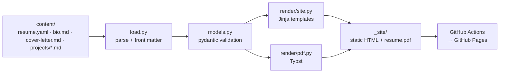

# kyut0.github.io

[](https://github.com/kyut0/kyut0.github.io/actions/workflows/ci.yml)

My portfolio site, built as a small data pipeline. Resume and project content live as
structured YAML/Markdown, are validated against typed schemas, rendered to static HTML,
and deployed to GitHub Pages on every push to `main`.

**Live site:** https://kyut0.github.io

## How it works



- **Extract:** `load.py` reads YAML and Markdown (with front matter) from `content/`.
- **Validate:** `models.py` defines strict pydantic models. Unknown fields, bad dates, and
  roles that end before they start fail the build.
- **Render:** `render/site.py` turns the validated `Site` into HTML using `site/templates/`,
  and `render/pdf.py` compiles the same resume data into `resume.pdf` and
  `cover-letter.pdf` with [Typst](https://typst.app/). One YAML file feeds both, so they
  can't drift apart. On the site, `render/timeline.py` reshapes the resume and projects
  into an interactive timeline that tracks where each tool was first picked up.
- **Deploy:** `.github/workflows/deploy.yml` builds and publishes `_site/` to Pages.

## Quickstart

Requires Python 3.13+ and [Poetry](https://python-poetry.org/) 2.x.

```bash
make install    # poetry install + pre-commit hooks
make serve      # build and serve at http://127.0.0.1:8000
```

| Command         | What it does                                  |
| --------------- | --------------------------------------------- |
| `make validate` | Validate content without writing anything     |
| `make build`    | Validate and render site + PDF into `_site/`  |
| `make check`    | Lint, type-check, and test (same as CI)       |
| `make themes`   | Check color themes and write a preview page   |
| `make format`   | Auto-fix lint issues and format               |
| `make clean`    | Remove build output and tool caches           |

## Repository layout

```
├── content/              # the data: what the site says
│   ├── resume.yaml
│   ├── bio.md            # home page intro
│   ├── about.md          # About page; its photos and art go in about/
│   ├── cover-letter.md   # general letter; published as a PDF only
│   └── projects/*.md     # one file per project; filename = URL slug
├── site/                 # the presentation: how it looks
│   ├── templates/        # Jinja templates
│   ├── typst/            # PDF resume + cover letter layouts
│   ├── themes.yaml       # color themes, built with seedpalette (ADR 0004)
│   └── static/           # CSS, images
├── src/portfolio/        # the pipeline
│   ├── models.py         # schemas
│   ├── load.py           # read + validate
│   ├── render/           # output renderers
│   └── cli.py            # `portfolio validate | build | serve`
├── tests/
├── docs/adr/             # architecture decision records
└── .github/workflows/    # CI + Pages deploy
```

## Adding content

- **Edit the resume:** edit `content/resume.yaml` and run `make validate`.
- **Add a project:** create `content/projects/<slug>.md` with front matter:

  ```markdown
  ---
  title: Flood Extent Mapping
  summary: One-line card description.
  date: 2025-06-01
  tags: [python, sar, geospatial]
  repo: https://github.com/kyut0/flood-mapping
  image: flood.png   # optional, lives in site/static/
  ---
  Write-up in Markdown…
  ```

## Roadmap

- [x] Phase 2: scaffold, schemas, HTML renderer, CI, Pages deploy
- [ ] Phase 3: ~~PDF resume rendered from the same YAML~~ ✅; GitHub API project ingestion
- [ ] Phase 4: real content, design and personal flair, custom domain
- [ ] Phase 5: launch, redirect the old Shiny app, archive the legacy repo

## License

Code is MIT. Site content (resume text, write-ups, images) is © Katy Yut, all rights
reserved. See [LICENSE](LICENSE).
