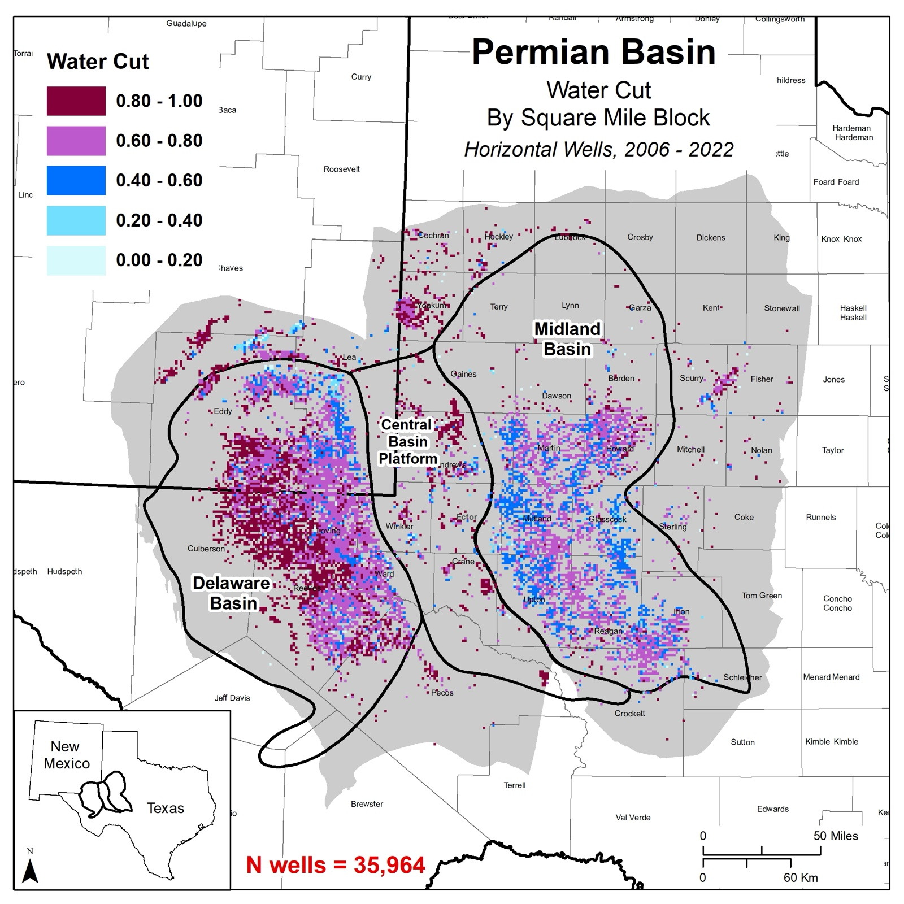
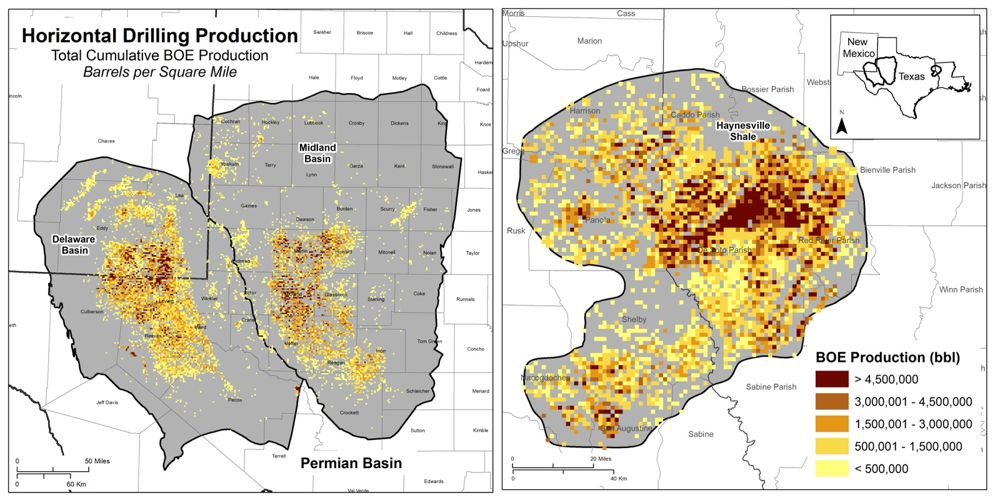
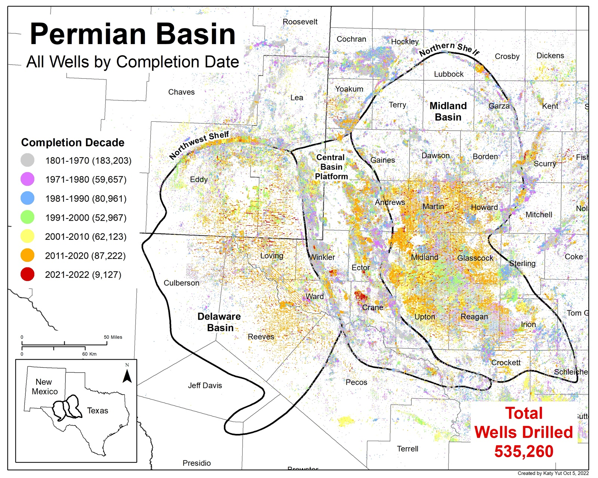

*University of Texas, Bureau of Economic Geology · 2022–2024*

## The problem

Unconventional oil wells in the Permian Basin produce large volumes of water alongside
oil, and that water has to be managed or disposed of. Understanding where production
and water volumes are concentrated is central to managing it.

## Approach

- Cleaned and joined well-level production data from **S&P Global (IHS) Enerdeq** in
  **R**, automating repetitive processing steps.
- Aggregated results onto **square-mile blocks** in **ArcMap**, so basin-wide patterns
  stay readable at the scale of the Delaware and Midland basins.

## Results

*Water cut (produced water ÷ (produced oil + produced water)) for 35,964 horizontal
wells completed 2006–2022, by square-mile block. Water cut runs highest across the
Delaware Basin.*

*Total cumulative oil and gas production (barrels of oil equivalent per square mile) for
horizontal wells in the Delaware and Midland basins and the Haynesville Shale.*

*All 535,260 wells drilled in the Permian Basin region, colored by decade completed,
from before 1970 through 2022.*

The maps supported research published as papers, posters, and presentations, including:

- Smye, K. M., **Yut, K.**, Reedy, R. C., Scanlon, B. R., Nicot, J. P., Hennings, P.
  (2024). Challenges with managing unconventional water production and disposal in the
  Permian Basin. *AAPG Bulletin* 108 (12), 2215–2240.
- Peng, S., Maraggi, L. M. R., Bhattacharya, S., **Yut, K.**, McMahon, T., Haddad, M.
  (2023). Feasibility of CO2 storage in depleted unconventional oil and gas reservoirs.
  *URTeC*.
