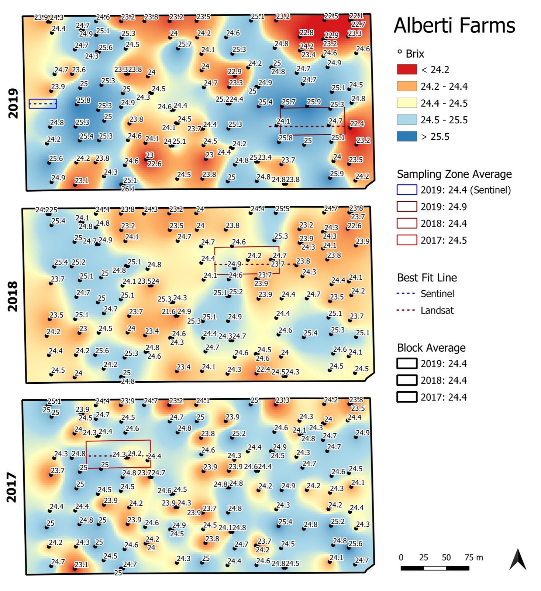
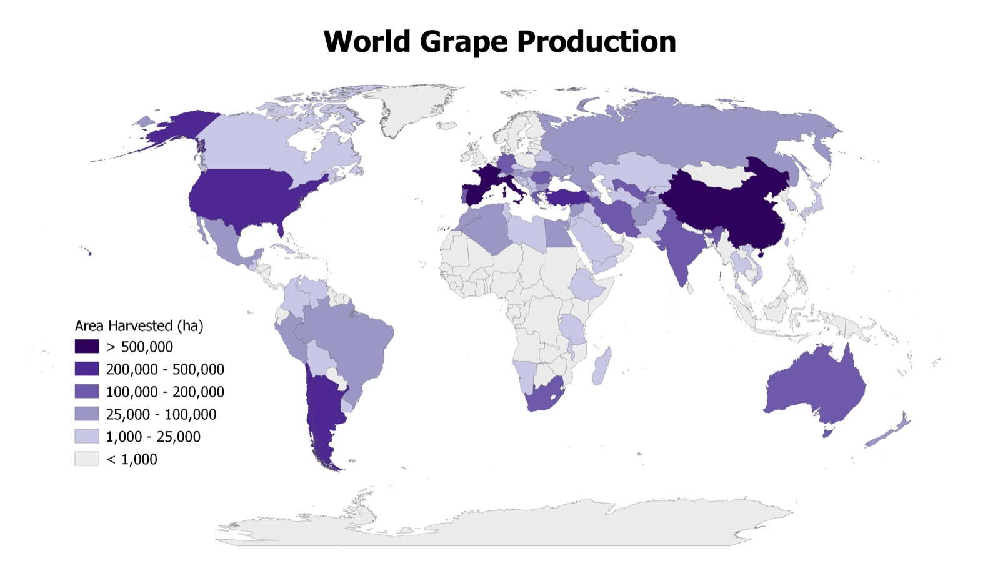

*E. & J. Gallo Winery · Viticulture Research GIS Intern · June–December 2020*

## The problem

Grape quality varies across a vineyard block, and field sampling is expensive. Gallo's
viticulture research team wanted to know where to sample, and how satellite imagery
could guide that, to make better irrigation decisions for yield and quality.

## Approach

- Managed large field and imagery datasets, and **automated satellite data acquisition**.
- **Kriging-interpolated Brix** (grape sugar content) across a vineyard block for the
  2017, 2018, and 2019 seasons.
- Compared **sampling algorithm** solutions driven by **Landsat** and **Sentinel**
  imagery against the measured block averages.
- Worked with cross-functional teams to turn the results into irrigation strategy.

## Results

*Kriging-interpolated Brix for 2017–2019 across a single block, with the sampling zones
chosen from Landsat and Sentinel imagery. The block averaged 24.4 °Brix each year, and
the satellite-driven sampling zones came within 0.5 °Brix of it. Built in QGIS.*

## Also

*World grape production by country (area harvested, hectares), produced in QGIS from
request to delivery within one business day.*
