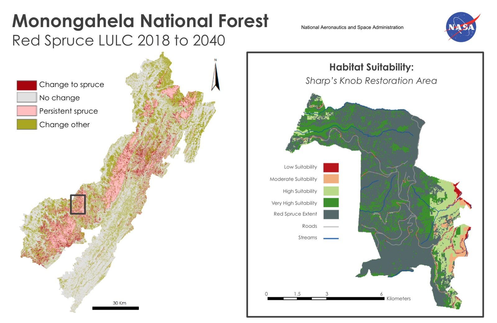

*NASA DEVELOP National Program, Summer 2019 · team project with M. Bull, T. Francis,
K. Weber, J. Spruce, and C. Jarnevich*

## The problem

Two centuries of logging and mining in the Monongahela National Forest, in the Allegheny
Highlands of West Virginia, dramatically altered its forests. The USFS wanted to restore
red spruce and needed to know where it stands today, how it has changed, and where
restoration would work best.

## Approach

- Combined **Landsat 5 TM**, **Landsat 8 OLI**, and **SRTM** elevation data, and
  collected training data for classification.
- Mapped red spruce stands for four dates from **1989 to 2018** with a classification
  tree algorithm.
- Scored habitat suitability for the **Sharp's Knob Red Spruce Restoration Area** with
  fuzzy logic, identifying non-native stands where red spruce would thrive.
- Used the 2018 classification in the **TerrSet Land Change Modeler** to forecast red
  spruce extent to **2040**.

My work spanned the literature review, training-data collection, running the
classification models, the site suitability analysis, and producing the final maps to
NASA's style guidelines, using ArcGIS, ENVI, TerrSet, and Google Earth Engine.

## Results

*Left: forecast land-cover change, 2018 to 2040, from the classification tree and
TerrSet Land Change Modeler. Right: habitat suitability for Sharp's Knob, built in
ArcMap.*

- **562 hectares** of Sharp's Knob are suitable for future restoration.
- Red spruce stands grew **8%** from 1989 to 2018.
- The forecast indicates the gains **won't continue without management intervention**.

[Read the full project summary on NASA DEVELOP →](https://develop.larc.nasa.gov/2019/summer/MonongahelaNationalForestEco.html)
