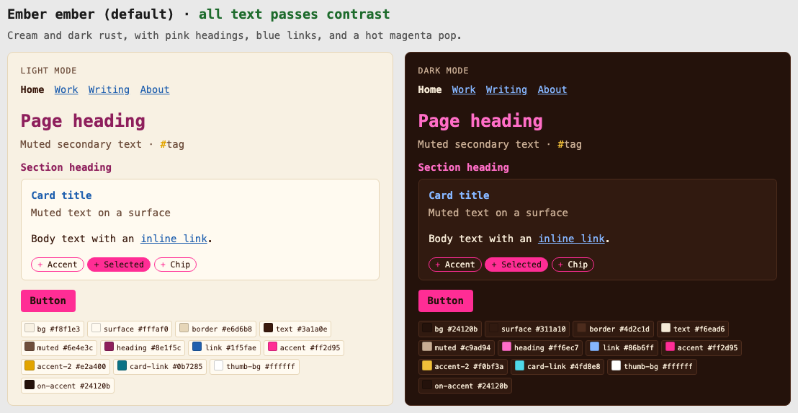

Picking colors is the fun part. Keeping them readable is the tedious part: a teal that
pops on a dark background can disappear on a light one, and every new theme adds a dozen
more color pairs to check by hand. I built seedpalette to treat a color theme like any
other dataset: validated input, deterministic transforms, generated output, and an audit
trail.



*The preview page seedpalette generates for each theme on this site. Pick one from the
gear menu at the top of any page to see it live.*

## How it works

1. **Seed:** a YAML file gives each theme four required colors per mode: background,
   heading, link, and accent.
2. **Derive:** seedpalette fills in the rest (cards, borders, body and secondary text,
   button text), tinting neutrals toward the background's hue so they feel like part of
   the palette.
3. **Check:** every text color is tested against [WCAG AA](https://www.w3.org/WAI/WCAG22/Understanding/contrast-minimum.html)
   contrast on both the page and card backgrounds.
4. **Fix and report:** any color that fails is darkened or lightened just enough to pass,
   and the report says exactly what changed.
5. **Output:** CSS custom properties, JSON, and an HTML preview of every theme. Every
   command exits non-zero if a theme can't be made readable, so it works as a CI gate.

For example, this site's Sage theme has a teal link color that reads at only 2.7:1 on its
pale green background. seedpalette deepens it just enough and leaves everything else
alone:

```console
$ seedpalette check site/themes.yaml
sage: Sage [ok]
  light adjusted --link: given #059ea1 reads at 2.72:1;
                         darkened to #007679 (4.50:1)
```

## Design choices

- **Adjust in a perceptual color space.** Colors are shifted in
  [OKLCH](https://bottosson.github.io/posts/oklab/) by changing only lightness, so a
  darkened teal stays teal instead of drifting toward gray, as it would mixed with black.
- **Change as little as possible.** Colors that pass are left exactly as given, and
  failing ones move in small steps until they first pass.
- **Desktop themes, too.** It imports [Omarchy](https://github.com/omacom/omarchy)
  desktop themes (fetched straight from GitHub by name) and exports web themes back to
  Omarchy, generating the terminal palette a desktop theme needs.

## Where it's used

This site's four color themes are a seedpalette file. The build fails if any theme stops
passing contrast, and the downloadable resume and cover letter are drawn in whichever
theme you've picked.

**Stack:** Python 3.13, Poetry, pydantic, Jinja, pytest, ruff, mypy (strict), pre-commit,
GitHub Actions.
