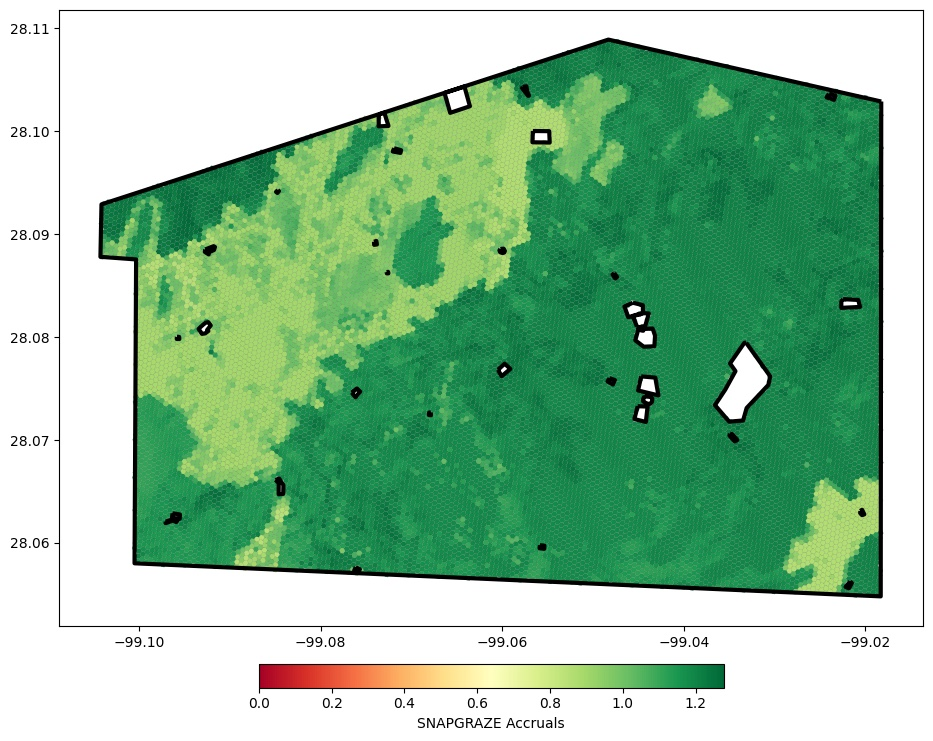

*Grassroots Carbon*

## The problem

Grassroots Carbon works with ranchers to build soil organic carbon (SOC) through better
grazing management. Model output is only useful if ranchers and project teams can see
*where* on a property the potential is highest.

## Approach

- Took per-location outputs from the **SNAPGRAZE** model of SOC accrual potential.
- Indexed them onto **Uber's H3** hexagonal grid. Equal-area hexagons make neighboring
  cells directly comparable and aggregate cleanly across resolutions.
- Masked excluded areas inside the ranch boundary and rendered the result in Python with
  **matplotlib**, using a diverging color scale so low- and high-potential areas read at
  a glance.

## Result

*SNAPGRAZE accrual potential on a ranch in Texas, on H3 hexagons. Outlined areas are
excluded from the project. Built in Python with matplotlib.*
